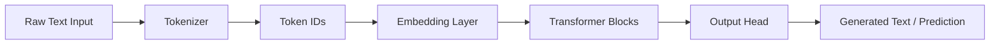
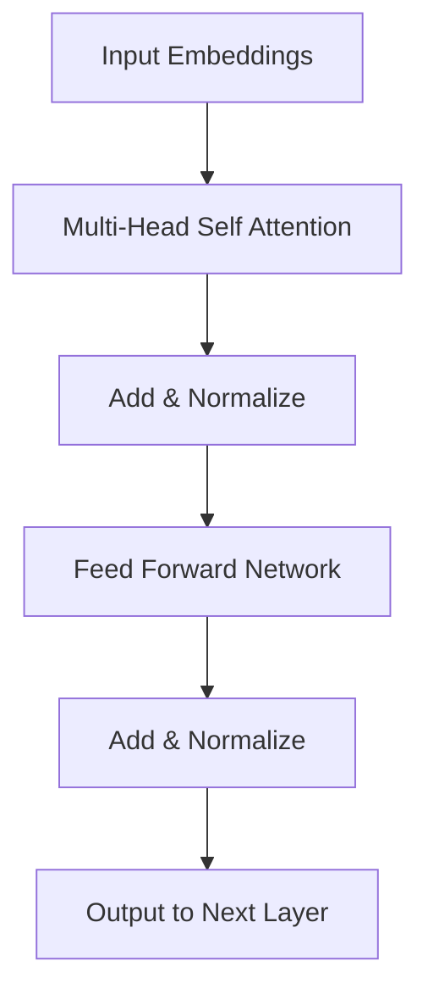
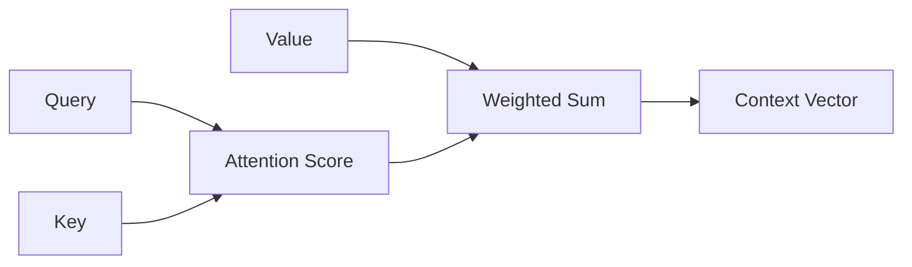
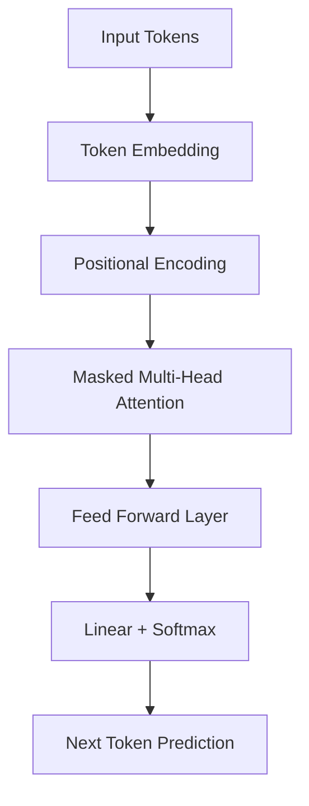
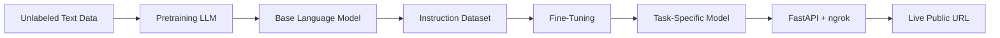

# 🤖 AI Personal Assistant – LLM From Scratch


## 🚀 Overview

This repository is a hands-on exploration of **Large Language Models (LLMs)** built from scratch. It covers the full pipeline — from **tokenization and attention mechanisms** to **GPT-style text generation, pretraining, fine-tuning**, and **live deployment** via FastAPI and ngrok.

The project is designed for learners who want to move beyond black-box APIs and gain a **deep, practical understanding of how LLMs work internally**.
LIVE LINK (works when the server is ready)  (https://unphilosophical-jeff-gracelike.ngrok-free.dev/)

> 🟢 **Live Demo:** Fine-tuned GPT-2 Medium (355M) deployed as a public REST API + Chat UI on Google Colab with ngrok.

---

## 🎬 Demo

> GPT-2 Medium fine-tuned on instruction data, served live via FastAPI + ngrok from Google Colab.

https://github.com/user-attachments/assets/29089728-2ebe-457c-915e-566abca7ea9b

---

## 🧠 High-Level Architecture

### 🔹 Overall LLM Pipeline



### 🔍 Transformer Block Architecture



### 🧩 Attention Mechanism Flow



### 🏗️ GPT-Style Text Generation



### 🔁 Training & Fine-Tuning Workflow



---

## 📂 Project Structure

| File / Notebook | Description |
|---|---|
| `tokenization_of_data_for_LLM_processing.ipynb` | Text tokenization for LLM pipelines |
| `attention_mechanism_with_and_without_training_weights.ipynb` | Attention mechanism with and without trained weights |
| `GPT_implementation_from_scratch_to_generate_text.ipynb` | GPT-style text generation from scratch |
| `Pretraing_model_on_unlabeled_data.ipynb` | Pretraining LLM on raw unlabeled text |
| `finetuning_of_LLM_models_and_use_as_spam_classifier.ipynb` | Fine-tuning LLM for spam classification |
| `AI_personal_trainer_using_LLMs.ipynb` | Instruction fine-tuning for personal trainer assistant |
| `AI_Personal_Trainer_Deploy_Colab_Ngrok.ipynb` | 🚀 **Deploy notebook — FastAPI + ngrok live hosting** |
| `gpt_download.py` | Script to download pretrained GPT-2 weights |
| `previous_chapters.py` | Shared model utilities and training helpers |
| `instruction-data.json` | Custom instruction-response dataset (1100 entries) |
| `loss-plot.pdf` | Training loss visualization |
| `accuracy-plot.pdf` | Training accuracy visualization |
| `temperature-plot.pdf` | Sampling temperature effects |
| `the-verdict.txt` | Sample pretraining text corpus |

---

## 🌐 Deployment (Colab + ngrok)

This project includes a full deployment pipeline to serve the fine-tuned model as a **live public API** directly from Google Colab.

### What gets deployed

| Endpoint | Method | Description |
|---|---|---|
| `/` | GET | Browser chat UI |
| `/chat` | POST | `{ instruction, input, max_tokens }` → `{ response }` |
| `/health` | GET | GPU status + model info |
| `/repo` | GET | Git commit history |
| `/docs` | GET | Auto-generated Swagger UI |

### Quick start

```bash
# 1. Open AI_Personal_Trainer_Deploy_Colab_Ngrok.ipynb in Google Colab
# 2. Runtime → Change runtime type → T4 GPU
# 3. Run all cells
# 4. Paste your ngrok token from dashboard.ngrok.com
# 5. Get your public URL and share it
```

### Example API call

```python
import requests

response = requests.post("https://your-id.ngrok-free.app/chat", json={
    "instruction": "Give me a 3-day beginner workout plan.",
    "input": "",
    "max_tokens": 200
})
print(response.json()["response"])
```

---

## 🛠️ Tech Stack

| Technology | Role |
|---|---|
| 🐍 Python 3.10+ | Core implementation language |
| 🔥 PyTorch | Tensor operations, model training |
| 🧠 GPT-2 Medium (355M) | Base pretrained model |
| ✂️ tiktoken | GPT-2 tokenizer |
| ⚡ FastAPI | REST API server |
| 🌐 ngrok | Public HTTPS tunnel |
| 📓 Jupyter / Colab | Interactive experimentation |
| 📊 Matplotlib | Training metrics visualization |

---

## ⚙️ Local Setup

```bash
git clone https://github.com/AnmolRajpoot25/AI_personal_assistant_LLM_from_scratch.git
cd AI_personal_assistant_LLM_from_scratch
```

Create a virtual environment:

```bash
python -m venv venv
source venv/bin/activate        # Windows: venv\Scripts\activate
```

Install dependencies:

```bash
pip install torch tiktoken fastapi uvicorn pyngrok nest-asyncio
pip install jupyter numpy pandas matplotlib scikit-learn tqdm requests
```

Run notebooks locally:

```bash
jupyter notebook
```

---

## 🎯 Learning Objectives

- Understand LLM internals from the ground up
- Implement tokenization, attention, and GPT architecture from scratch
- Learn pretraining and instruction fine-tuning pipelines
- Visualize attention weights and training dynamics
- Deploy a fine-tuned LLM as a live REST API with a browser chat UI

---

## 🤝 Contributing

Contributions are welcome!

- Add more experiments or fine-tuning datasets
- Improve documentation and explanations
- Optimize training workflows
- Add evaluation metrics (BLEU, ROUGE, LLM-as-judge)
- Extend the deployment notebook (Docker, HuggingFace Spaces, etc.)

---

## 📄 License

This project is open source under the [MIT License](LICENSE).